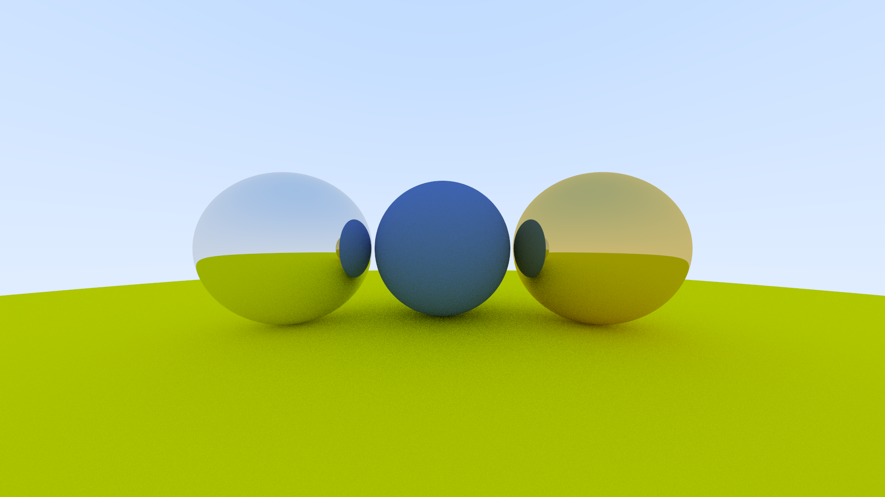
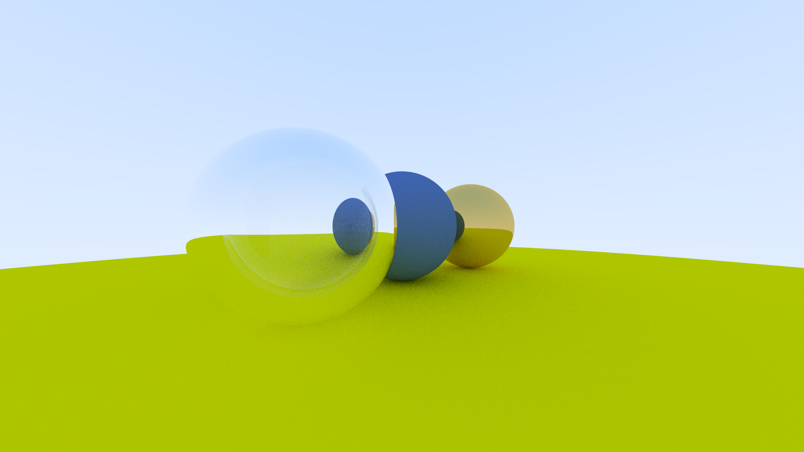
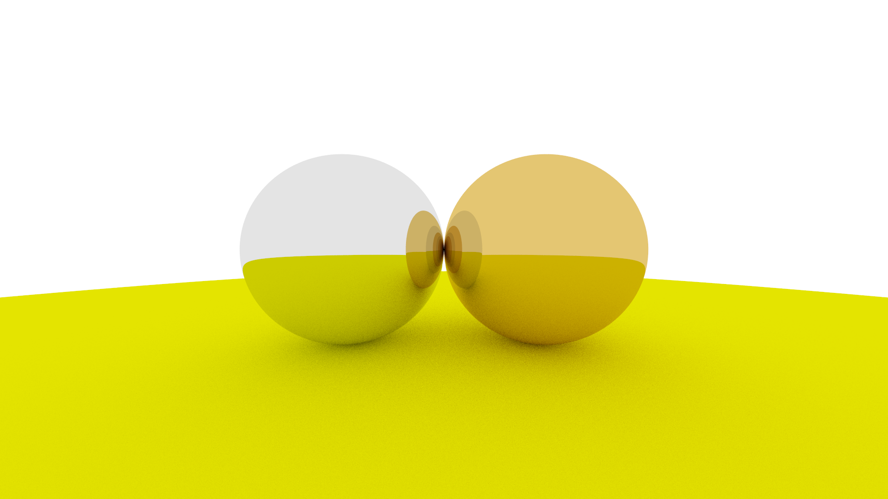

### Ray Tracer

This is a simple realization of a [ray tracing algorithm](https://en.wikipedia.org/wiki/Ray_tracing_(graphics)).







### Install, Build and Run

The entire project is written in C++. Also there is Python for generating output PNG files. Check Python3 and pip3 versions.

```bash
$ python3 --version
Python 3.x.x

$ pip3 --version
pip 24.x.x ...
```

Ensure that dependencies are installed

```bash
$ pip3 show pillow
$ pip3 show pybind11
$ pip3 show numpy
```

Install if not

```bash
$ pip3 install pillow
$ pip3 install pybind11
$ pip3 install numpy
```

##### Build

```bash
$ cmake -B build
$ cmake --build build --config Debug
$ cmake --build build --config Release
```

##### Run Renderer

```bash
$ ./build/rt arg1 arg2 arg3
```

### Working Plan

- [x] Diffuse reflection
- [x] Mirror reflection
- [x] Snell's refraction

### Todo

- [x] blue sky
- [ ] defocus blur
- [ ] multithreading
- [ ] final image (random objects)
