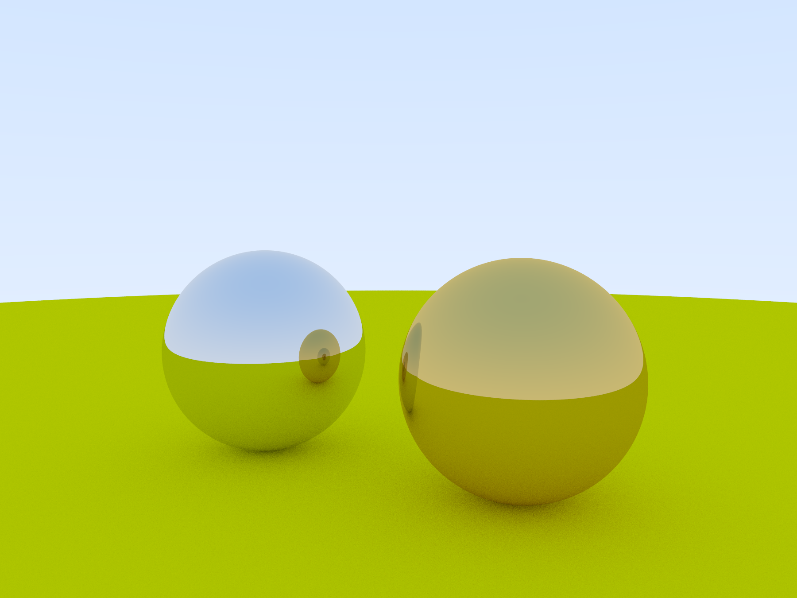

### Ray Tracer

This is a simple realization of a [ray tracing algorithm](https://en.wikipedia.org/wiki/Ray_tracing_(graphics)).



### Build Renderer

```bash
$ cmake -B build
$ cmake --build build
```

### Usage

```bash
$ ./build/rt --cfg=scenes/balls.cfg
```
