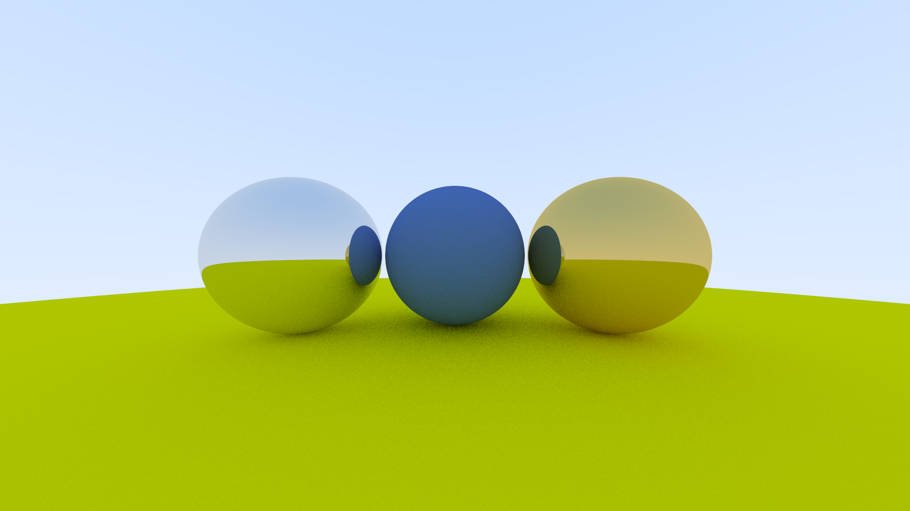
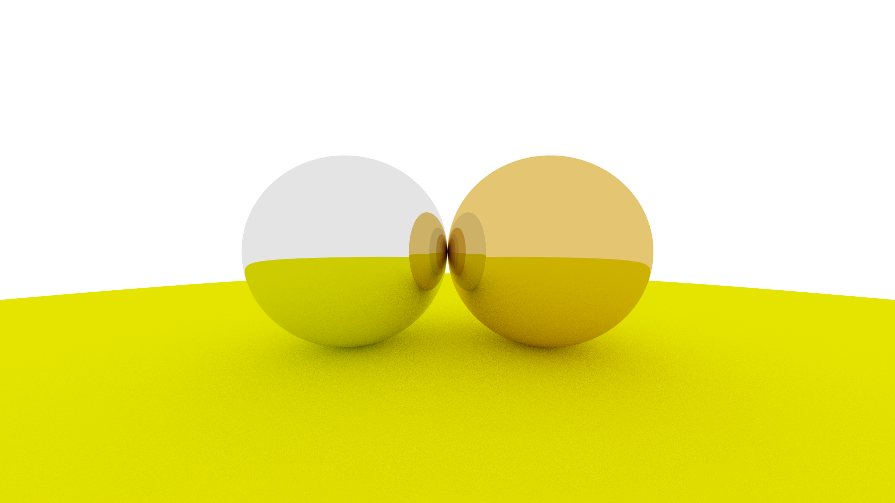

### Ray Tracer

This is a simple realization of a [ray tracing algorithm](https://en.wikipedia.org/wiki/Ray_tracing_(graphics)).





### Build Renderer

```bash
$ cmake -B build
$ cmake --build build
```

### Usage

```bash
$ ./build/rt \
    [--obj=<path>] \
    [--opt=<path>] \
    [--mode=full|dept|norm] \
    [--output=<path>]
```

<details>
    <summary>OPTIONS</summary>

    --obj       Path to the Wavefront .obj file
    --opt       Path to the camera options .opt file
    --mode      Rendering mode: full, dept, norm
    --output    Path to the output .png image file

</details>